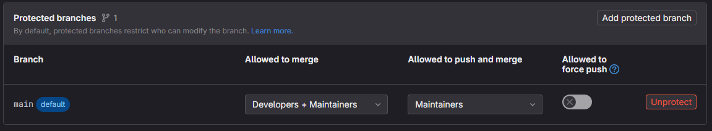

# USGS Data Science tutorial for Git and GitHub workflow

This template repository contains the issues and starting content to teach the DS fork-and-pull style workflow. For the full experience, it requires a course contact to review and merge your pull requests. 

## I'm a learner

1. Go to the repo that matches your username (`https://code.usgs.gov/wma/dsp/trainings/gitflows-trainings/ds-gitflows-[username]`) and fork it. There are a couple of differences from GitHub here. On code.usgs.gov, the button to do this says "Forks" instead of "Fork". Additionally, when you fork, you will be asked to choose a namespace. At the bottom of the list there is a namespace for you own account. Choose this.
1. On your fork, click on `course-instructions.md` to start the course.

## I'm leading the course

This repo is to be used as a "template". **Rather than forking it, we download it and re-upload it under another name.**

1. For each participant, create a new blank project in the ["gitflows trainings" group](https://code.usgs.gov/wma/dsp/trainings/gitflows-trainings). Use the naming convention `ds-gitflows-[username]` for each participant. Choose "Internal" visibility. Do not allow the system to create a README. These will be considered the canonical repositories for each participant.
1. Set the project you just created to be accessible by the user. Manage -> Members -> Invite Members. **Use the "Developer" role.**
1. In the project you just created, go to Settings -> Repository, choose "Protected branches", and set `main` up to be protected with permissions like this: 
1. For each participant, clone the repo you are looking at now to a fresh directory on your local computer, and then push it to the project you just created in the step above. Use commands like the following:

```bash
git clone git@code.usgs.gov:wma/dsp/trainings/ds-gitflows-static-template.git scratch_directory
cd scratch_directory
git remote rename origin old-origin
git remote add origin git@code.usgs.gov:wma/dsp/trainings/gitflows-trainings/ds-gitflows-[username]
git push -u origin
cd ..
rm -rf scratch_directory
```
